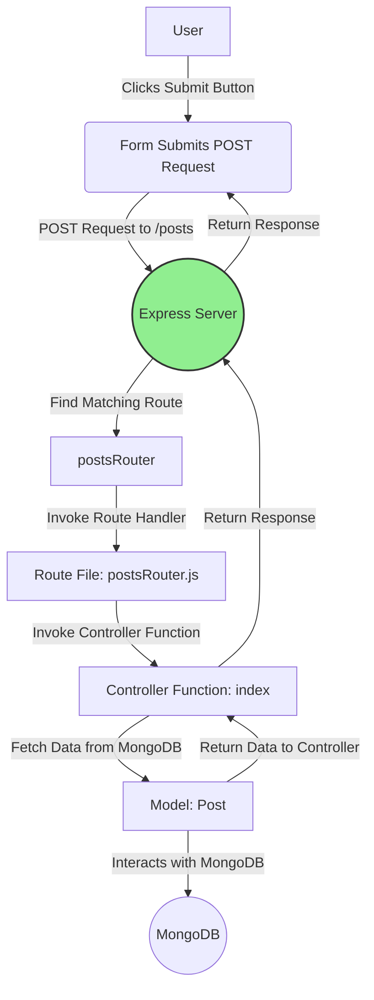

# charts

```mermaid
graph TD;
    A[User] -->|Clicks Submit Button| B(Form Submits POST Request);
    B -->|POST Request to /posts| C((Express Server));
    C -->|Find Matching Route| D[postsRouter];
    D -->|Invoke Route Handler| E[Route File: postsRouter.js];
    E -->|Invoke Controller Function| F[Controller Function: index];
    F -->|Fetch Data from MongoDB| G[Model: Post];
    G -->|Interacts with MongoDB| H((MongoDB));
    G -->|Return Data to Controller| F;
    F -->|Return Response| C;
    C -->|Return Response| B;
	click A call callback()


    style C fill:#90EE90,stroke:#333,stroke-width:2px;
```

